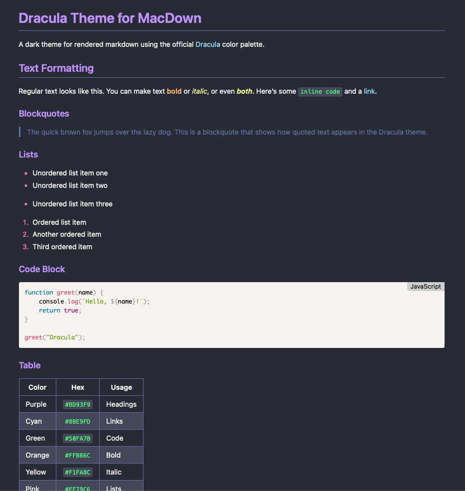

# Dracula for [MacDown](https://macdown.uranusjr.com/) Preview CSS

> A dark theme for [MacDown](https://macdown.uranusjr.com/)'s rendered markdown preview.

## About

This theme styles the **preview pane** (rendered markdown) in MacDown. For the **editor pane** (syntax highlighting), see the official [Dracula for MacDown](https://draculatheme.com/macdown) theme.

## Install

All instructions can be found at [draculatheme.com/macdown-css](https://draculatheme.com/macdown-css).

## Team

This theme is maintained by the following person(s) and a bunch of [awesome contributors](https://github.com/dracula/macdown-css/graphs/contributors).

|  |
| --- |
| [James Fishwick](https://github.com/jamesfishwick) |

## Community

- [Twitter](https://twitter.com/draculatheme) - Best for getting updates about themes and new stuff.
- [GitHub](https://github.com/dracula/dracula-theme/discussions) - Best for asking questions and discussing issues.
- [Discord](https://draculatheme.com/discord-invite) - Best for hanging out with the community.

## License

[MIT License](./LICENSE)
